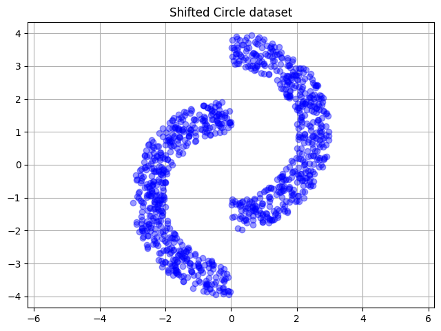

# vae

Demos + presentation of Variational Autoencoders (VAEs)

## Contents

- [vae](#vae)
  - [Contents](#contents)
  - [Installation](#installation)
  - [Results](#results)
    - [Visualise dataset](#visualise-dataset)

## Installation

This package can be installed locally in "editable mode" with the following commands:

```
python -m pip install -U pip
python -m pip install -e .
```

## Results

### Visualise dataset

```bash
python scripts/plot_shifted_circle.py
```


