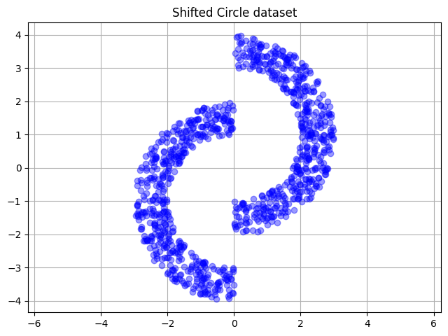
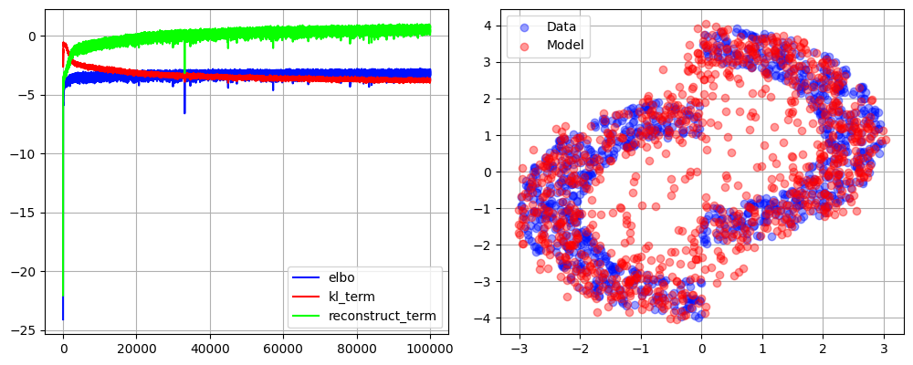
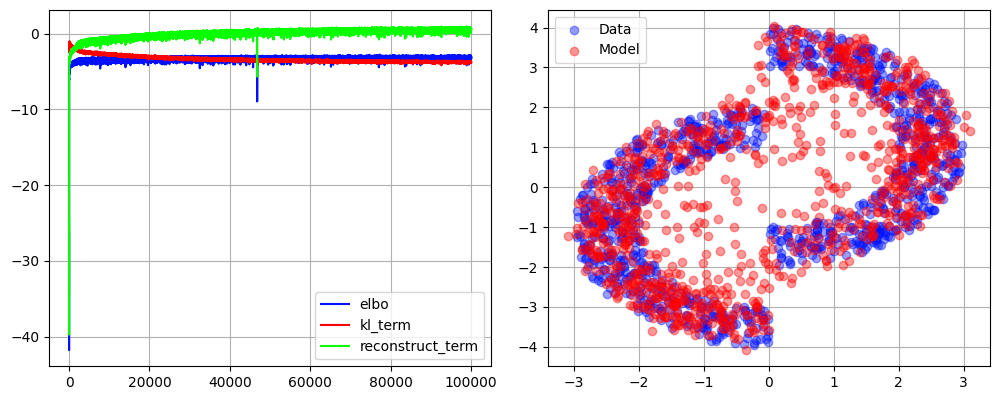
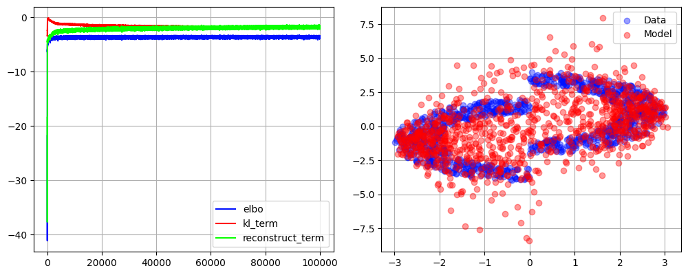

# vae

Demos + presentation of Variational Autoencoders (VAEs)

## Contents

- [vae](#vae)
  - [Contents](#contents)
  - [Installation](#installation)
  - [Results](#results)
    - [`plot_shifted_circle`](#plot_shifted_circle)
    - [`train_vae_circle`](#train_vae_circle)

## Installation

This package can be installed locally in "editable mode" with the following commands:

```
python -m pip install -U pip
python -m pip install -e .
```

## Results

### `plot_shifted_circle`

```bash
python scripts/plot_shifted_circle.py
```



### `train_vae_circle`

```bash
python scripts/train_vae_circle.py
```



```bash
python scripts/train_vae_circle.py --seed 1
```



```bash
python scripts/train_vae_circle.py --seed 2
```


